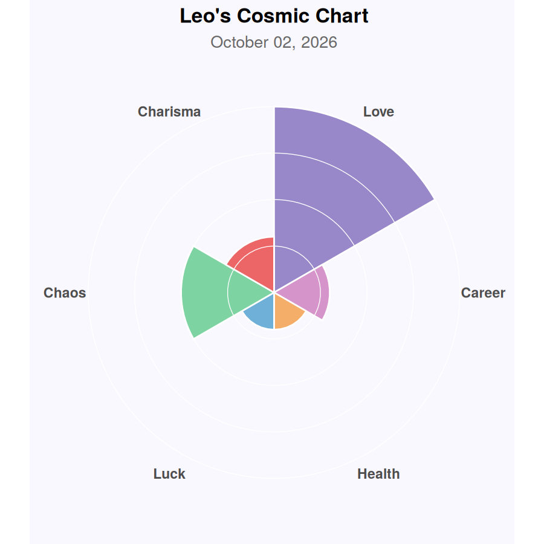

# 🔮 Procedural Cosmic Fortune Generator


A silly little R project that generates a random horoscope-style fortune
from mix-and-match templates, then plots your "cosmic energy" for the day
as a radial chart with `ggplot2` + `coord_polar()`.



```
========================================
  Leo | LUCK
----------------------------------------
The universe owes you one small, teal
miracle.
========================================
```

## Quick start

```bash
git clone https://github.com/Karisfangxt/horoscope-generator.git
cd horoscope-generator
Rscript -e 'install.packages(c("ggplot2", "glue"))'
Rscript main.R
```

That's it — a random fortune prints to your console and a matching chart
saves to `outputs/`.

## Usage

```bash
Rscript main.R                # random sign, random category
Rscript main.R Leo            # force a sign
Rscript main.R Leo career     # force a sign + category
```

Or interactively in R / RStudio:

```r
source("data/templates.R")
source("R/generate_fortune.R")
source("R/cosmic_chart.R")

fortune <- generate_fortune(sign = "Scorpio")
print_fortune(fortune)
plot_cosmic_chart(fortune)
```

## More examples

| Sign | Category | Fortune |
|------|----------|---------|
| Scorpio | Chaos | Scorpio, nothing will make sense today, and that's the point. |
| Virgo | Love | Your heart and an unopened email are more connected than you think this week. |
| Leo | Luck | The universe owes you one small, teal miracle. |

## Project layout

```
horoscope-generator/
├── main.R                    entry point — run this
├── data/
│   └── templates.R           word banks + sentence templates
├── R/
│   ├── generate_fortune.R    builds the fortune text + energy levels
│   └── cosmic_chart.R        plots the radial "cosmic chart"
├── images/
│   └── example_chart.png     screenshot used in this README
└── outputs/                  generated charts land here
```

## Make it your own

The fun part is editing `data/templates.R`:

- Add new phrases to any word bank (`cosmic_nouns`, `advice_phrases`, etc.)
- Add a new category by adding a new named entry to the `templates` list
- Add new placeholders by adding new `sample(...)` args inside
  `generate_fortune()` in `R/generate_fortune.R`, then reference them in
  your templates as `{your_placeholder}`

**Contributions welcome** — if you've got a funnier template, a new
category (sports? pets? office life?), or a nicer color palette for the
chart, open a PR. The sillier the better.

## License

MIT — see [LICENSE](LICENSE).
